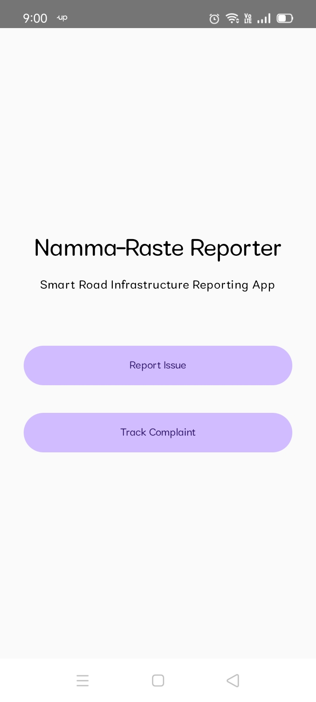
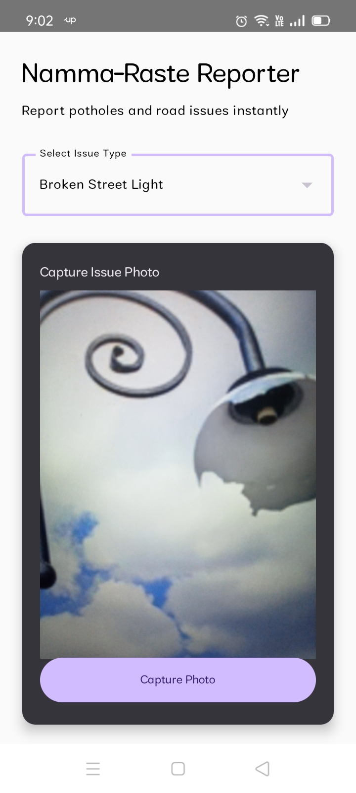
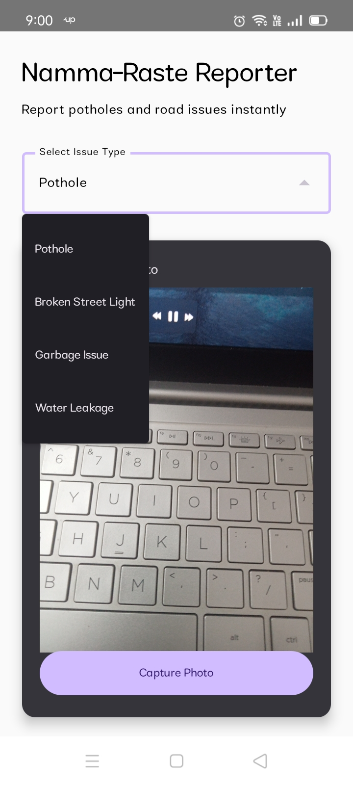
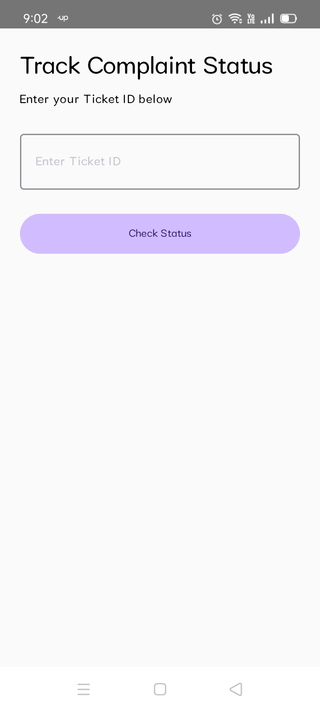

# JobScreeningAI
AI-powered job screening system using Ollama, Streamlit, and SQLite
# 🤖 JobScreeningAI

An AI-powered job screening system that automates the recruitment process using local LLMs via Ollama, with a Streamlit interface and SQLite for storing shortlisted candidates. This tool streamlines job description summarization, CV parsing, candidate matching, and interview invitation scheduling.

---

## 🚀 Features

- 📄 **JD Summarizer**: Extracts key skills, responsibilities, and qualifications from uploaded job descriptions using Gemma 2B (via Ollama).
- 👤 **CV Parser**: Extracts education, skills, experience, and certifications from uploaded candidate CVs (PDF or TXT).
- 🔍 **Match Scoring**: Compares candidate profiles with JDs and calculates a match score.
- ✅ **Shortlisting**: Automatically selects candidates who meet the threshold score.
- 📧 **Interview Scheduler**: Generates and sends personalized interview invitation emails.
- 🧠 **Runs Locally**: No cloud API usage — 100% local inference using lightweight open models.

---

## 🧠 Tech Stack

- **[Ollama](https://ollama.com)** – Runs LLMs like Gemma 2B locally
- **[Gemma 2B](https://ai.google.dev/gemma)** – Google’s lightweight open LLM
- **[Streamlit](https://streamlit.io/)** – For frontend interface
- **SQLite** – Local database to store shortlisted candidates
- **PyMuPDF (fitz)** – PDF text extraction for CVs
- **Python 3.8+** – Backend logic and integration

---

## 📁 Project Structure

JobScreeningAI/ ├── app.py # Streamlit UI ├── config.py # Global config like match threshold ├── README.md ├── requirements.txt ├── Job_Description_Summarizer/ │ └── jd_summarizer.py ├── CV_Reader/ │ └── cv_reader.py ├── Matching_and_Shortlisting/ │ └── matching_algorithm.py ├── Interview_Scheduler/ │ ├── interview_scheduler.py │ └── email_templates/ │ └── template.txt ├── Database/ │ ├── sqlite_database.py │ └── job_screening.db ├── utils/ │ └── pdf_reader.py

---

## ⚙️ Setup & Run Instructions

1. **Clone the repository**  
   ```bash
   git clone https://github.com/YOUR_USERNAME/JobScreeningAI.git
   cd JobScreeningAI
2. **Create and activate virtual environment**
   python -m venv venv
   venv\Scripts\activate  # For Windows

# App Screenshots

## Home Screen


## Camera Screen


## Selecting the issue


## Status Screen

